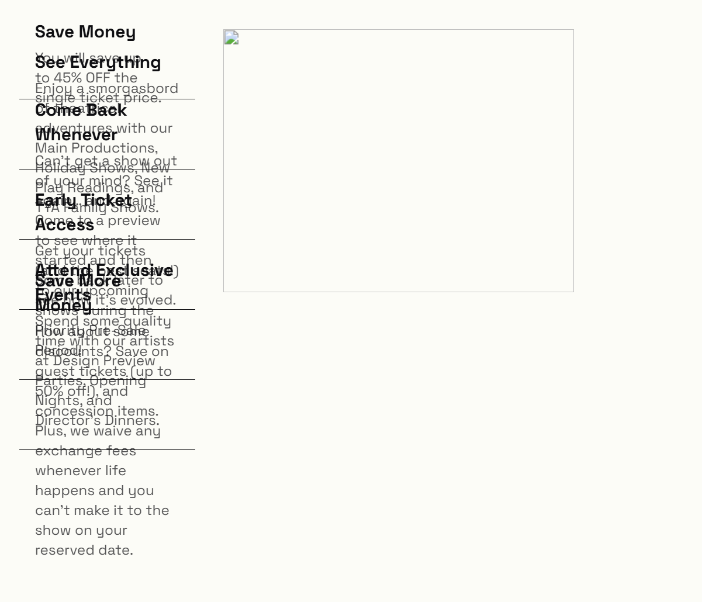

# FOR ALL
- rename theatrum/<block>

## core/button(fill) 
- doesn't do hover swipe FE or BE

## board-member

## breadcrumbs

## card-carousel
- editor shows the simplified card builder on BE, FE show replicate because it looks better and works better on the FE
- [ ] won’t save media selected in BE
- [ ] squished on FE
- [ ] nav arrows don’t work on FE, but the horizontal scroll works on the BE

## copyright-date-block
- rename to theatrum/copyright-date
## cover-card
- working on home page
- on blocks page "Error: Error fetching data" on BE
- renders correctly on FE
## cover-carousel
- [ ] too many options in inspector panel, can’t see more than 1 slide at a time.
- [ ] won’t save opacity set in BE
- [ ] nav doesn't work on FE, can't see other slides
- [ ] should show slide as nested blocks
## heading-toggle ❌ use accordion block instead
- doesn't save input text BE
## icon-list 
- looks nice, but need list item as a nested block, model after core/list and core/list-item blocks
## media-popover
- works nicely, is it possible to use on tables?
- BE wp dasicons missing
## popup
- sync button, border, border-radius, and shadow??
## svg-icon ❌ just use icon block OR custom html to animate
- fine, but it's rendering as img not svg and i want svg so i can animate it with css
## thumbnail-list
- editor shows static builder UI; 3D flip is frontend-only
- doesn't save or display image on FE or BE
- text overlaps on FE 
## meta-button
## meta-date
## meta-embed
## meta-field
## meta-file
## meta-gallery
## meta-icon
## meta-image
## meta-related
## meta-repeater
## meta-time
## production-credits 
## production-details ❓ is this used anywhere
- green "Production Details - Server rendered"
## production-performances
- doesn't respond to block-spacing setting
## production-quotes
- doesn't respond to font-size setting
## production-trailer
## term-meta 
## season-producer
- is this necessary? maybe just use term meta field
## site-option
## staff-member
## query-filter
- editor shows the dashed preview chip; real filter is frontend-only